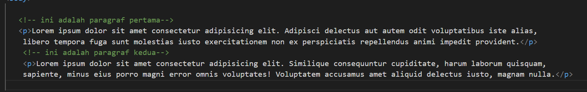
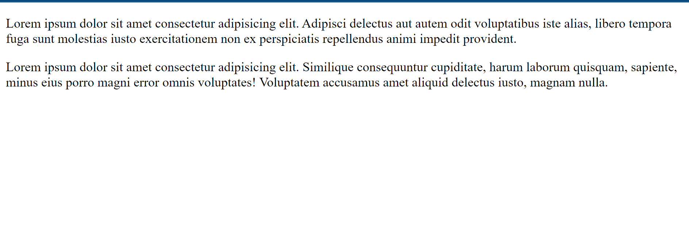
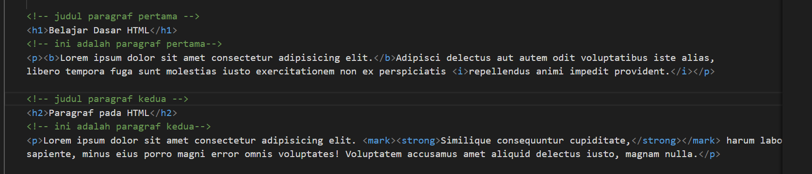
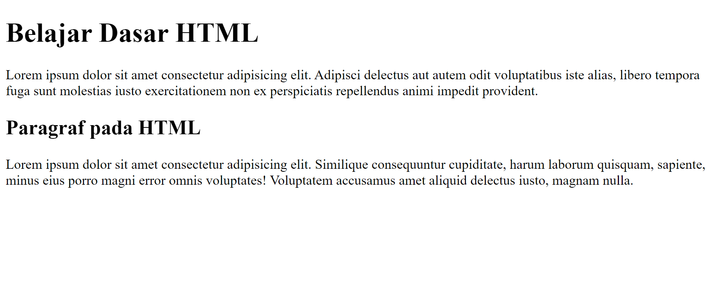
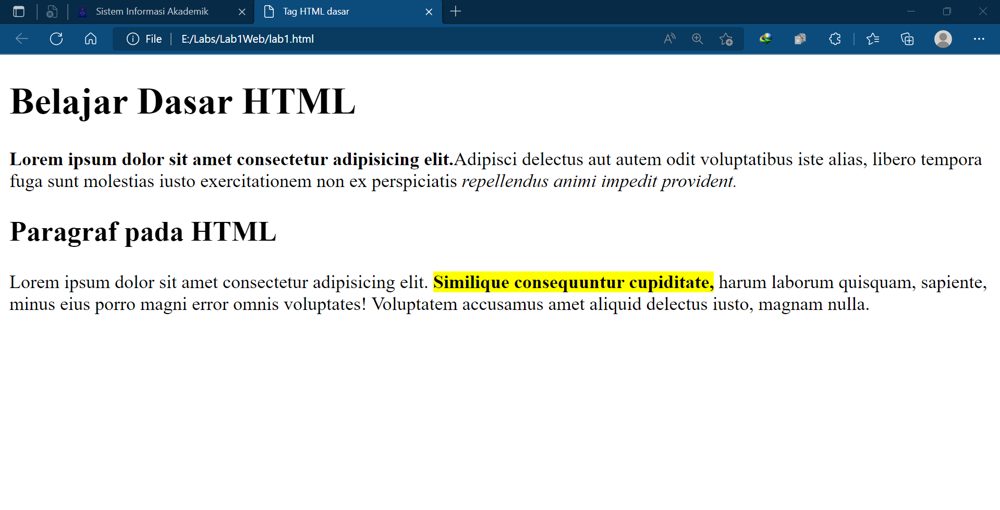
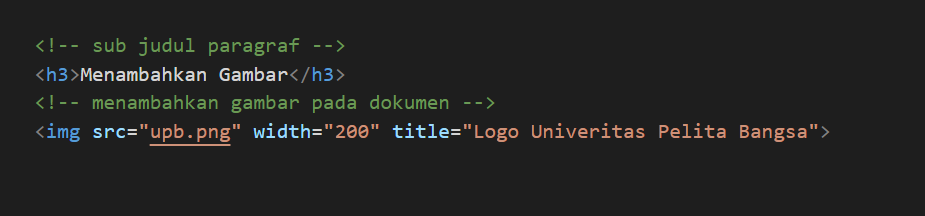
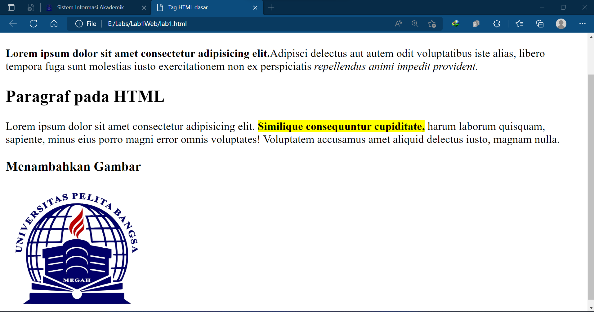
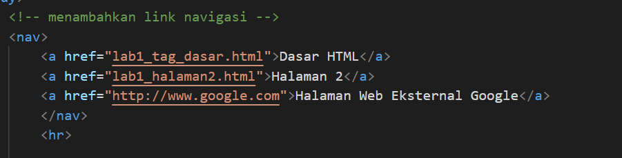
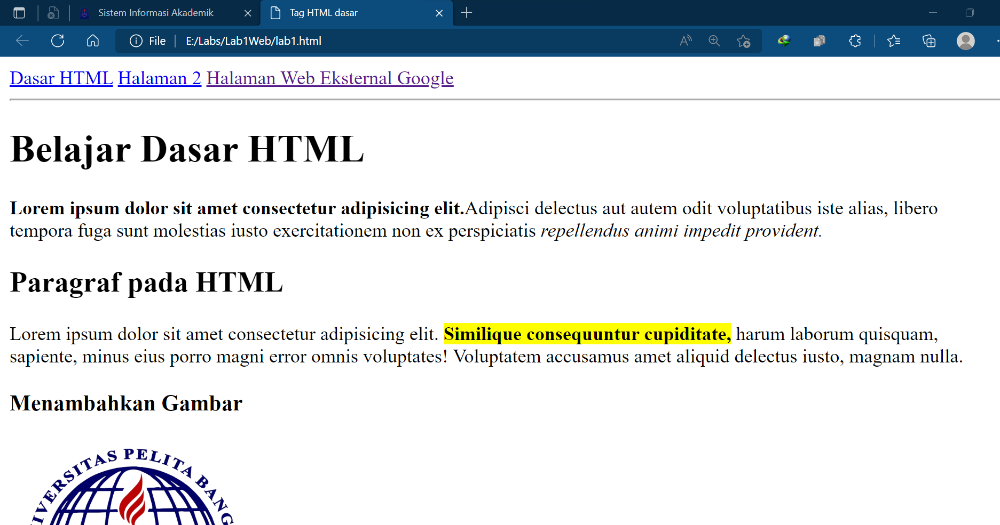

# Lab1Web

## langkah langkah praktikum
1. Membuat Paragraf
Untuk membuat paragraf pada HTML dapat menggunakan tag 
. Penulisannya adalah dimulai dari tag pembuka 
 dan diakhiri dengan tag penutup 

Atribut Align pada Tag 

Align left. Value pada atribut ini berfungsi untuk merapikan paragraf agar menjadi rata kiri.
Align center. Value ini berfungsi untuk mengatur paragraf rata tengah.
Align right. Value ini untuk merapikan paragraf menjadi rata kanan.
Align justify. Valui ini untuk mengatur paragraf supaya rata kanan dan kiri di HTML. Tag inilah yang biasa digunakan untuk merapikan tulisan di html.
contoh :

2. Menambahkan Judul
Heading merupakan sebuah judul yang biasanya digunakan pada sebuah halaman artikel pada web.
Atau terkadang dibeberapa bagian dari halaman web.
Judul atau heading pada dokumen HTML dapat dibuat dengan menggunakan tag <h1> sampai <h6>.
Tag <h1> merupakan judul pada lever pertama, kemudian level berikutnya atau sub judul pada tag
<h2> dan seterusnya sampai tag <h6>.
contoh :

3. Memformat teks
Ada beberapa tag yang dapat digunakan untuk memformat teks pada paragraf. Diantaranya adalah
sebagai berikut:
Tag Keterangan
<b> Bold text
<strong> Important text
<i> Italic text
<em> Emphasized text
<mark> Marked text
<small> Smaller text
<del> Deleted text
<ins> Inserted text
 Subscript text
 Superscript text
Contoh :

4. Menyisipkan Gambar
Image atau gambar dapat disisipkan kedalam halaman web. HTML menyediakan tag khusus untuk
dapat menampilkan gambar. Tag yang digunakan untuk menampilkan gambar adalah 
dengan atribut src sebagai URL atau Path file gambar berada. Tag ini dapat memuat gambar dengan
berbagai jenis ekstensi file gambar.
Atribut lain yang dapat digunakan untuk pengaturan gambar adalah
Atribut = Keterangan
src = lokasi gambar yang akan ditampilkan
width = ukuran lebar gambar
height = ukuran tinggi gambar
alt = deskripsi tentang gambar
title = judul gambar
Contoh :

5. Menambahkan Hyperlink
Link atau Hyperlink merupakan elemen HTML yang berfungsi untuk menghubungkan satu halaman
web dengan halaman web yang lain, baik internal maupun eksternal.
Link juga dapat menghubungkan beberapa bagian pada halaman yang sama atau disebut sebagai
Anchor.
Elemen link ini dapat diklik sehingga akan membuka halaman atau bagian sesuai dengan URL yang
diberikan pada link tersebut.
Untuk membuat Hyperlink atau Anchor menggunakan tag <a> dengan menambahkan atribut href
sebagai penentu URL yang dimaksud.
Contoh :

